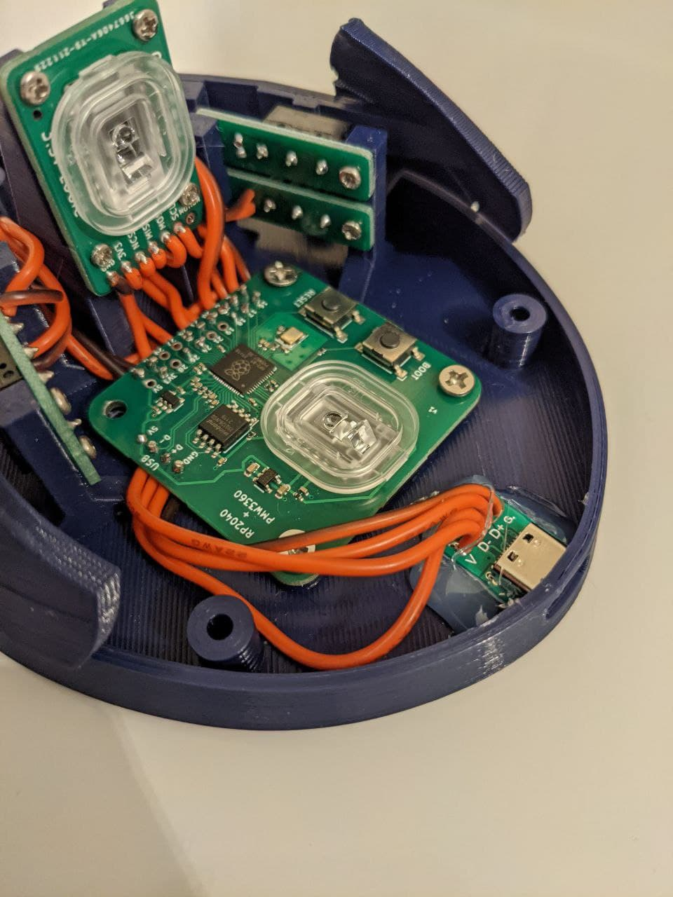

# USB C mod

This directory contains an alternative bottom shell model for those who would
rather have a USB C port instead of a non-detachable cable. This is designed for
this kind of USB C breakout board which use a through-hole USB C port mounted on
top of a PCB: https://www.aliexpress.com/item/1005002795893679.html

You can wire up this breakout board in the same way you would wire up a USB
cable, and then secure it with hot glue similar to how you would have secured
the cable with hot glue. This is shown in the image below. You may want to use
more hot glue than is used in the image.

