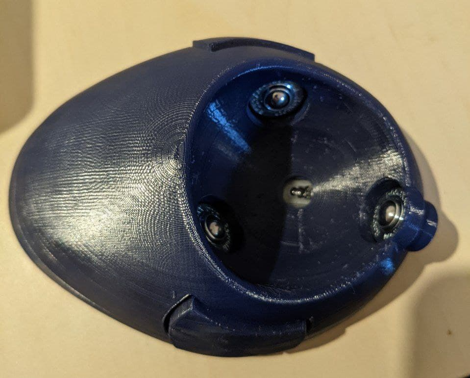
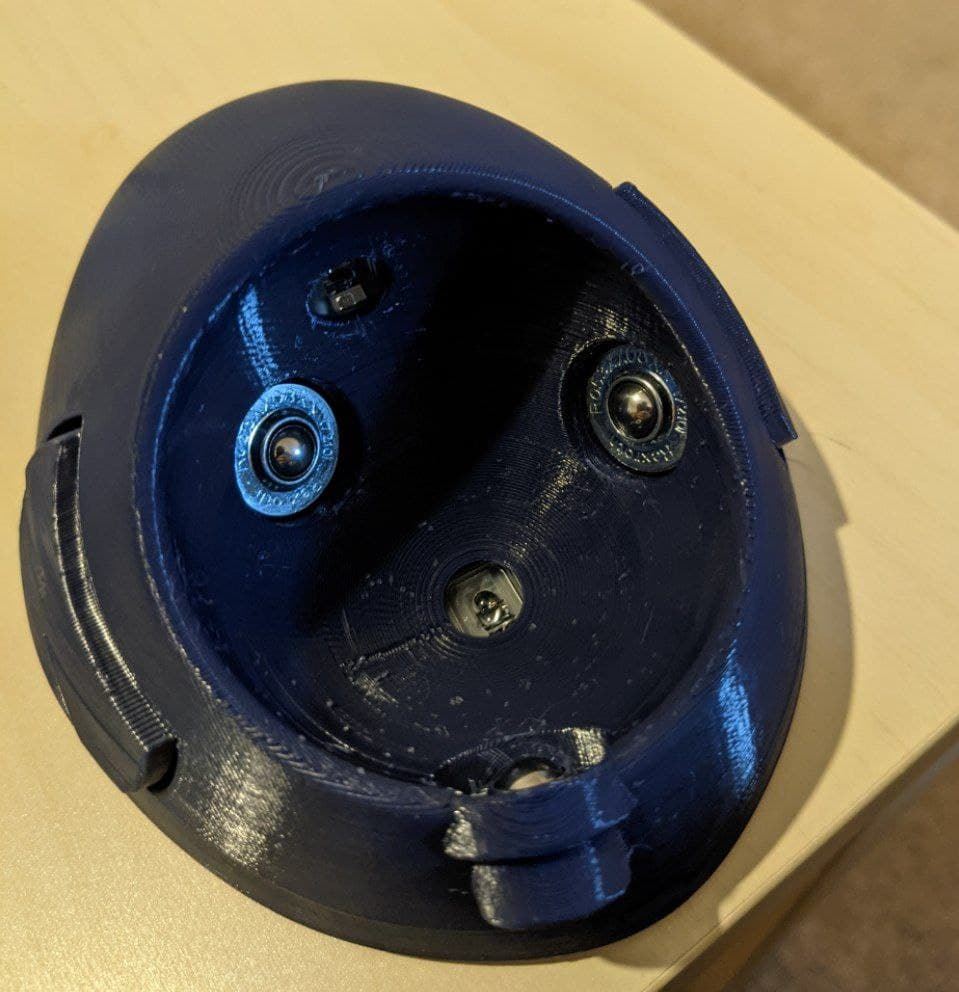

# BTU mod

This directory contains an alternative top shell model for those who would
rather use BTUs (ball transfer units) instead of static bearings. BTUs are
extremely smooth with almost no static friction at all. You can refer to the
[Ploopy BTU mod](https://github.com/ploopyco/classic-trackball/tree/master/hardware/Mechanicals-BTU-Mod)
for more info.

This is designed to be used with the Bosch-Rexroth R053010810, or KU-B8-OFK.
These are the same BTUs that the Ploopy BTU mod is designed for.

Included is a parametric OpenSCAD file where you can tweak the tolerances,
bearing angles, and socket dimensions, so you could adapt it to use different
BTUs if you wanted, or apply the mod to another trackball. This OpenSCAD file
depends on [BOSL](https://github.com/revarbat/BOSL).

Many thanks to [George Bryant](https://github.com/gbrnt) for designing the
Ploopy BTU mod which was a very helpful reference when designing this.

