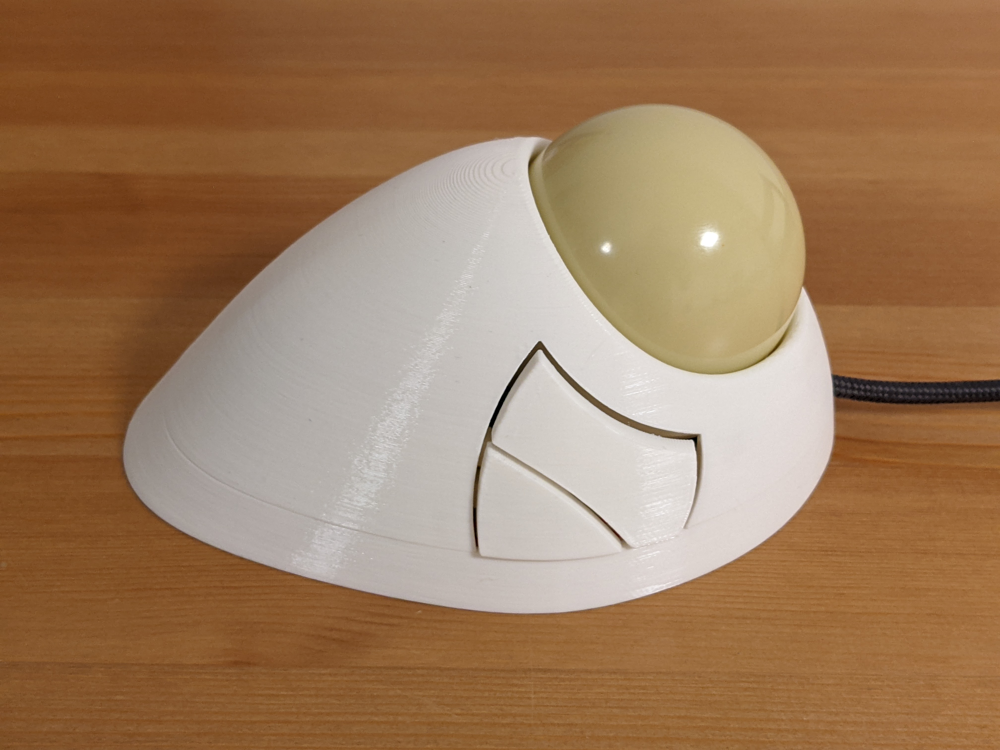
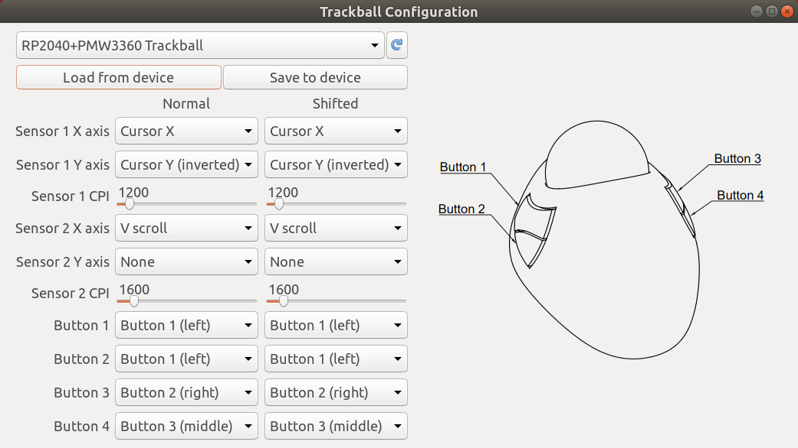
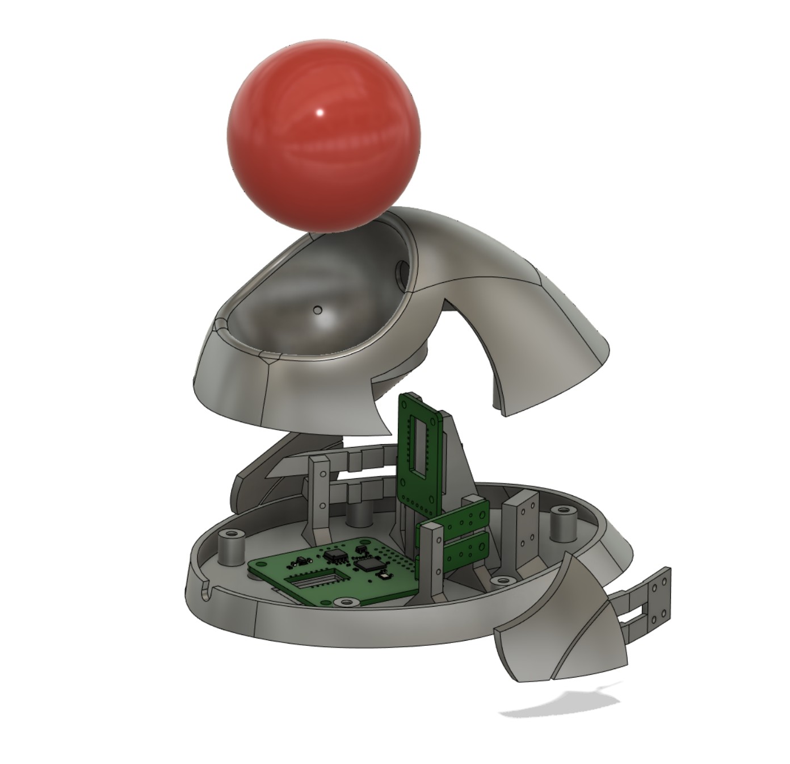
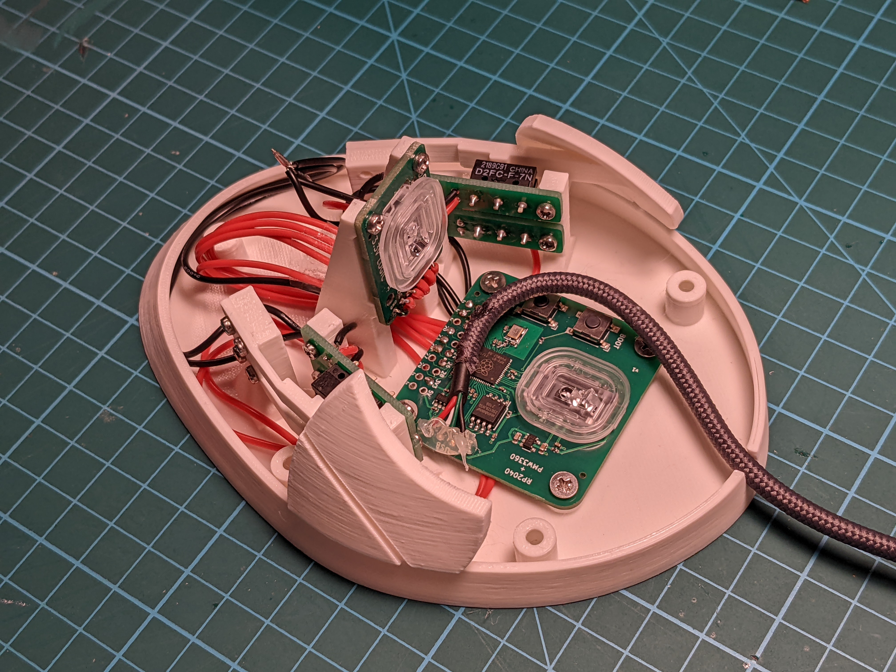

# DIY trackball with twist-to-scroll

This repository contains design files and code that can be used to make a fully programmable four-button USB trackball that can scroll by rotating the ball around the vertical axis. It achieves that by having two optical sensors.

Here's a [video](https://www.youtube.com/watch?v=dVZCyMe__IE) demonstrating the twist-to-scroll function.

It uses the following components:

* 57.2mm billiard ball
* two PMW3360 optical sensors
* [RP2040+PMW3360 PCB](https://github.com/jfedor2/rp2040-pmw3360)
* [PMW3360 breakout PCB](https://github.com/jfedor2/pmw3360-breakout) for the second sensor
* [button switch mount PCBs](https://github.com/jfedor2/mouse-switch-mount-pcb)
* [3D printed case](3d-models)
* Omron D2FC switches (or similar)
* 2.5mm zirconium oxide (or silicon nitride) bearing balls
* M3x4 screws for mounting the main PCB and assembling the case
* M2x4 screws for mounting the buttons and the secondary PCBs
* USB cable (cut off the device end and solder the wires directly to the PCB)

The main PCB uses the RP2040 chip from Raspberry Pi. The firmware supports remapping of ball and button functions using a configuration tool without the need to recompile the source code. All the configuration is stored on device, so the configuration tool is only needed to change the settings, not during normal use.

The twist-to-scroll function is a work in progress, but it already works pretty well. High resolution scroll is supported (on Windows and in some cases on Linux).

So far I only tested the configuration tool on Linux, but it should in theory run on Windows and Mac as well. I will try to provide ready-to-use packages in the future.

The provided [UF2 file](firmware/trackball.uf2) can be used to flash the firmware onto the device. When first connected, a "RPI-RP2" drive will show up and you flash the chip by copying the UF2 file to that drive. If you want to flash it again, hold the BOOT button and press the RESET button on the board.

I printed the case parts with 0.2mm layer height. The top and bottom parts don't need supports, the buttons do.

The pin numbers are defined at the top of [trackball.cc](firmware/src/trackball.cc).

